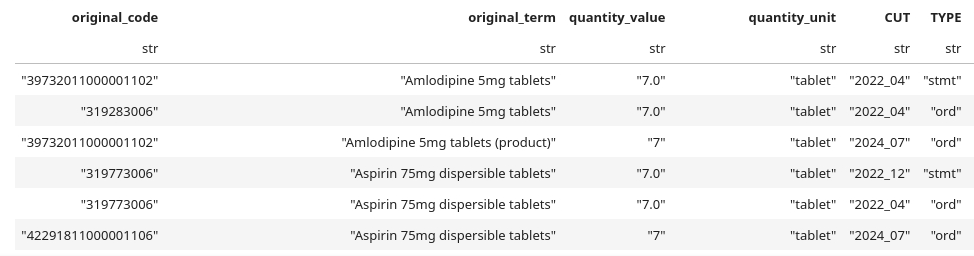
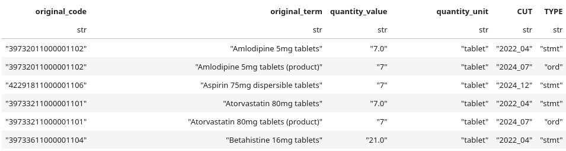
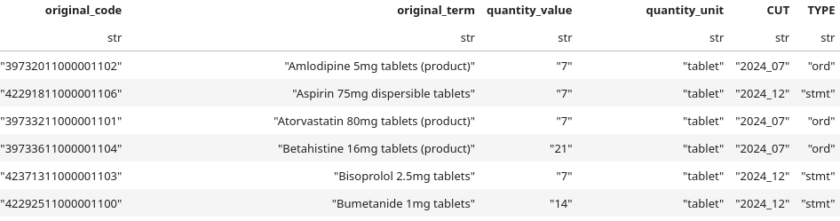

# `MED_PY` — python pipeline for prescribing data collection in Genes & Health


<!--  -->

## Authors & Contributors

* Stuart Rison

## Summary

The Genes & Health (G&H) `MED_PY` pipeline extracts and processes prescribing data from G&H raw phenotypic data.
At present, this is limited to prescribing data from NEL primary care records.

## Phenotype data

The pipeline imports G&H phenotype data in `.../library-red/phenotypes_rawdata/`.  These data are from:

**DSA__Discovery_7CCGs**: Primary care data from the North East London ICS \[North East London: ~45,000 individuals with data\]

We anticipate adding secondary care data sources in the future.

## Input files

No input files at present.

## Output files

TBC

## Locations/paths naming convention

1. We do not use relative paths.
2. We do not explicitly use the word FOLDER in the naming, so `MEGADATA_LOCATION`, not `MEGADATA_FOLDER_LOCATION`.
3. Locations and paths are in `UPPER_CASE`.
4. When referred to as `_LOCATION`, the variable contain a string with the path.
5. When referred to as `_PATH`, the variable is an `AnyPath` path object.
6. The folder order is "what it is" / "Where it's from" so, for example megadata/primary_care not primary_care/megadata; so `MEGADATA_PRIMARY_CARE_LOCATION` or `PROCESSED_DATASETS_PRIMARY_CARE_PATH`

## How the pipeline works

### Deduplicating prescribing data

The problem is that there is a huge amount of redundancy in the raw data:
* Prescriptions are duplicated between cuts
* Identical or near identical prescriptions are found in `ord` (repeat) and `stmt` (short-term medication and treatment) entries
* Different SNOMED codes for the same entity are captured by different cuts

So for one patient, there are **97 prescriptions assigned to a single date**!

**Solution**

The pragmatic solution is not to distinguish `ord` and `stmt`and to de-duplicate in stages.

#### Stage 1: De-duplicate same medication name issued to same patient on the same day

_Problem:_
<p>

_Solution:_
```python
.sort(by=[ pl.col.original_code.str.len_chars(), pl.col.CUT ], descending=True)
.unique(
    [
        "pseudo_nhs_number",
        "clinical_effective_date",
        "original_term",
    ]
)
```
_Explanation_

We sort on the length of the original code looking for longest SNOMED codes, this is because NHS SNOMED codes are typically longer that "international" SNOMED codes:

* 319283006 |Product containing precisely amlodipine besilate 5 milligram/1 each conventional release oral tablet (clinical drug)|
* 39732011000001102 |Product containing precisely amlodipine 5 milligram/1 each conventional release oral tablet 1 tablet tablet (clinical drug)| \[this one has children that are UK meds\]

We then pick the row from the most recent cut

_Outcome:_
<p>

97 rows --> 36 rows

#### Stage 2:  De-duplicate same SNOMED code, different `original_term`

_Problem_
<p>

_Solution:_
```python
.sort(by=[ pl.col.original_term.str.len_chars(), pl.col.CUT ], descending=True)
.unique(
    [
        "original_code"
    ]
)
```
_Explanation_

We sort on the length of the `original_term`, this is because the longer the `original_term` the more likely it is the be the fullest description.

_Outcome:_
<p>

36 rows --> 30 rows

#### Impact

In the case of the individual with 97 prescriptions, we go from 97 rows to 30 rows.
In the case of all individuals, we go from 35_107_228 rows to --> 23_122_567 rows --> 22_943_164 (65% of initial num rows).
